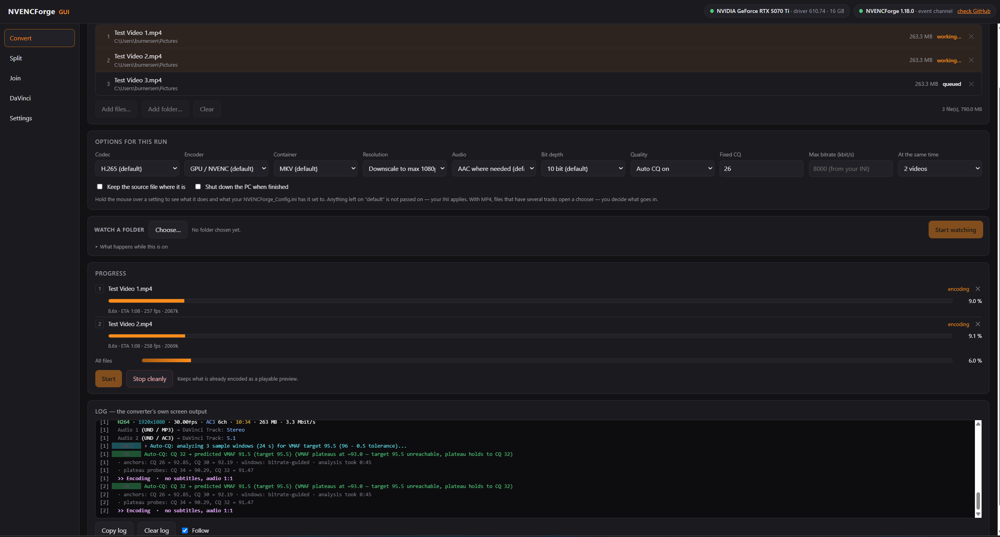

<div align="center">

# 🖥️ NVENCForgeGUI

### Drop your videos in, press Start, watch it happen.

**A window for [NVENCForge](https://github.com/burnersen/NVENCForge) — for everyone who would rather click than type.**
Same converter, same results, same settings file — just visible.

*⚙️ The window never converts anything itself. It starts the unchanged `NVENCForge.exe` and reads what it reports — so every quality decision stays exactly where it was.*

[](https://github.com/burnersen/NVENCForgeGUI/actions/workflows/ci.yml)
[](#-requirements)
[](#-requirements)
[](#what-it-is-built-on)
[](#building-it-yourself)
[](#-license)
[](https://ko-fi.com/burnersen)

**[⬇️ Download the latest release](https://github.com/burnersen/NVENCForgeGUI/releases/latest)** · **[⌨️ Prefer the command line?](https://github.com/burnersen/NVENCForge)** · **[☕ Buy me a coffee](https://ko-fi.com/burnersen)**

*Free for personal & noncommercial use — [source-available](#-license), never for resale.*



</div>

---

**📑 Contents**

- [⚡ 30 seconds, no manual](#-30-seconds-no-manual)
- [🤔 Which of these is you?](#which-of-these-is-you)
- [✨ What you get](#-what-you-get)
- [🪟 The six pages](#-the-six-pages)
- [🚦 The window never converts anything itself](#-the-window-never-converts-anything-itself)
- [💻 Requirements](#-requirements)
- [🛡️ SmartScreen warnings](#smartscreen)
- [🔧 Building & tests](#building-it-yourself)
- [📜 License](#-license) · [💬 Feedback](#-feedback) · [☕ Support](#-support)

---

<a id="-30-seconds-no-manual"></a>

## ⚡ 30 seconds, no manual

1. Download `NVENCForgeGUI.exe` from the [releases](https://github.com/burnersen/NVENCForgeGUI/releases/latest) and put it wherever you like.
2. Start it. If `NVENCForge.exe` is missing, **one click fetches the latest one** from its own repository — and it then sets itself up (configuration file and FFmpeg) without you doing anything else.
3. Drop a video in and press Start.

Nothing is installed, nothing is written to the registry. Delete the folder and it is gone.

---

<a id="which-of-these-is-you"></a>

## 🤔 Which of these is you?

| The problem | The answer |
|---|---|
| **I'd rather click than remember flags.** | Every option the converter has is a switch or a dropdown here. Hover over one and it tells you what it does. |
| **I keep picking the same settings over and over.** | Save them under a name as a **profile** and pick them again with one click — on the Convert page and for the watched folder. |
| **My downloads folder keeps filling up with huge videos.** | Point the **Watch** page at it and forget about it. Every video that lands there is converted on its own, and a download in progress is left alone. |
| **I want to keep working while it converts.** | The percentage sits at the front of the window title and fills the **taskbar button**. Send the window away; it flashes when the batch is done. |
| **DaVinci Resolve won't import my file.** | **Split** it with the Resolve-ready option: a silent MP4 plus every audio track in a format Resolve actually accepts, subtitles cleaned — and **Join** it back when you're done editing. |
| **I need the streams out and back in, bit for bit.** | Split and Join both offer a pure 1:1 copy. No re-encode, no cleaning — a true lossless round-trip. |
| **I have no idea what half those settings do.** | The **Settings** page is built from `NVENCForge_Config.ini` itself: what each key does, what is allowed, and what your file currently says. |

---

## ✨ What you get

- 🖱️ **Drag and drop** — files or whole folders, subfolders included.
- 📊 **Live progress** — one line per running converter: file, bar, speed, ETA, bitrate, output size so far.
- 👯 **Up to three videos at once.** Measured here with four 90-second clips: two at a time took **52 seconds instead of 72**. A third brought nothing more — the graphics card is busy by then. You pick 1, 2 or 3.
- 👀 **Watch a folder, on its own page.** Point it at your downloads folder and forget about it: every video that lands there is converted on its own. A file is only picked up once it has stopped growing for 30 seconds, so a download in progress is left alone. It has its **own options, its own progress and its own log** — it runs beside a batch you started by hand instead of writing over it, one video at a time, and never more than three converters exist across both areas (two when either side encodes on the processor).
- 🪓 **The lossless tools, with buttons:** take a video apart into its tracks, or put them back together. Both directions ask the same question: bit-for-bit, or Resolve-ready with AAC audio and cleaned subtitles.
- ☑️ **The track chooser** — when a file has several audio tracks or subtitles, you tick what you want instead of typing numbers.
- ⚙️ **Every setting explained.** The Settings page is built from `NVENCForge_Config.ini` itself: hover over anything and it tells you what it does, what is allowed, and what your file currently says. The subtitle cleaner's phrase list is editable there too, instead of in a text editor.
- ✋ **Stop one, or stop all.** Each converter has its own ✕; what is already encoded is kept as a playable preview.
- 🌙 **Shut the PC down when it's done.** Tick it whenever you like — before the batch or halfway through it. The machine only switches off once *every* area of the window is finished, no folder is being watched, and nothing is converting outside this window either. Windows then gives you a minute, and the warning here has a cancel button.
- 🏷️ **Keep your settings under a name.** A set of options you use often can be saved as a profile and picked again with one click — on the Convert page, and for the watched folder as well.
- 💰 **See what it has been worth.** A quiet line along the bottom edge counts two things from the very first run: the space saved and the time spent converting. Nothing else — no week, no month, no resetting itself.
- 📶 **Progress on the taskbar button.** The percentage sits at the front of the window title and fills the taskbar button, so you can send the window away and still see how far it is. When a batch finishes, the button flashes. No sound.
- ℹ️ **An About page** that says which versions are running, under what licence, what the window is built on, and exactly what it puts on your disk.
- 🔄 **It can update itself** — on the About page, and only when you press the button: the window never asks GitHub on its own. If there is a newer release it says so, and one click fetches it, puts it in place and restarts the window. The version you were running is kept as a `.bak` file in the `tools` folder, so there is always a way back. Not while a conversion is running or a folder is being watched — a restart in the middle of a run would cut the converter off from its window.
- 🛡️ **It picks itself back up.** The Windows web view this window is drawn with sometimes stops while starting. That is a Windows fault, not the converter's, and no file is ever harmed by it — but until now it meant starting the program again by hand. So the program now runs as a tiny watcher plus the window itself (two entries in Task Manager, on purpose: the watcher holds no web view and cannot be hit by the fault). If the window drops out, the watcher brings it straight back, twice at most, and closes the message for you — except on the last try, so a lasting problem still says what it is. Measured cost: 0.01 s of start-up time.
- 🌗 **Day or night.** A switch at the bottom left turns the window light or dark, and it remembers which you chose. The log keeps its dark ground either way — the colours in there come from the converter itself and are meant for one.
- 📍 **It stays where you put it.** Size and place are remembered between starts, and starting it a second time brings the open window forward instead of opening a rival that fights over the same files.

---

## 🪟 The six pages

| Page | What it is for |
|---|---|
| 🎬 **Convert** | The main job: drop videos in, pick the options, press Start. Up to three run side by side. |
| 🪓 **Split** | Take a file apart into its tracks — bit-for-bit, or Resolve-ready (silent MP4 + audio Resolve accepts + cleaned subtitles). |
| 🧩 **Join** | Put picture, audio and subtitles back into one file. Same question, same two answers. |
| 👀 **Watch** | A standing order for one folder: whatever video lands there gets converted, one at a time, with its own options, progress and log. Watching lasts while the window is open. |
| ⚙️ **Settings** | `NVENCForge_Config.ini`, made readable. Every key explained, with its allowed values and your current one. |
| ℹ️ **About** | Versions, licences, what the window is built on, which files it writes to your disk — and the button that fetches a new version of the window itself. |

---

## 🚦 The window never converts anything itself

It starts the unchanged `NVENCForge.exe` as a separate process, hands it the options on the command line and reads its machine-readable event channel (`-json`). Quality decisions, bitrate caps, the GPU capability probe — all of that stays exactly where it was. If a converter is already sitting in `tools\`, it is used as it is.

That is the design rule throughout: **no button may lie.** What is not built is greyed out rather than pretending to work, and nothing on screen claims anything the converter did not report.

<details>
<summary><b>How several converters share the work</b></summary>

Each file gets its own process, and up to three run side by side.

The obvious alternative — handing the same file list to every instance and letting the converter's own `.lock` files sort it out — was measured and dropped. It is a race: when one instance moves a finished original into `originals` while another is still probing that same file, the second one reports *"No such file or directory"* for a file that is in fact finished. One process per file is just as fast (53 seconds against 52) and reports honestly.

The tool modes (Split, Join, DaVinci) always run one at a time. They copy instead of encoding — the disk is the limit there, not the card — and they ask about tracks, where two dialogs at once would be a nuisance.

</details>

---

## 💻 Requirements

- **Windows 10 or 11 (x64).** The window uses the WebView2 runtime that Windows already ships — nothing extra to install.
- **An NVIDIA graphics card** (GTX 10 series or newer) for GPU encoding. Without one, NVENCForge can still convert **on the processor** — slower, but it works.
- **`NVENCForge.exe`** — not part of this repository. If it is missing, one click in the window fetches the latest release; the converter then downloads FFmpeg on its own first run.

---

<a id="smartscreen"></a>

## 🛡️ Windows SmartScreen / antivirus warnings

Windows or your antivirus may warn you the first time you run `NVENCForgeGUI.exe`. The honest reason: **the EXE is not code-signed.** Signing certificates cost several hundred euros *per year*, and this is a free hobby project with zero income. Unsigned Go binaries are frequent false-positive targets; there is nothing I can do about it except be transparent.

You don't have to trust me blindly: **scan it** on [VirusTotal](https://www.virustotal.com), **read it** — the complete source is in this repository — or **[build it yourself](#building-it-yourself)**.

If SmartScreen blocks the start: click **"More info" → "Run anyway"**.

---

<a id="building-it-yourself"></a>

<details>
<summary><b>🔧 Building it yourself</b></summary>

Needs [Go](https://go.dev/) and [Wails v2](https://wails.io/).

```
wails build
```

**Without `-clean`** — that would delete `build\bin\tools\` and with it the converter sitting next to the window.

The interface is a single HTML file with no build step: no npm, no bundler, no node_modules.

</details>

<details>
<summary><b>🧪 Tests</b></summary>

```
go test ./...
Get-ChildItem frontend\*_check.js | ForEach-Object { node $_.FullName }
```

The `*_check.js` files run the window's own script without a browser and check what the display really does: that a bar never reports more than the converter said, that the start button carries the mode of the page you are on, that an answer goes back to the converter that asked. Every check is written so that breaking the code on purpose makes it fail — a check that stays green when the code is wrong is worth nothing.

The live tests (`NVENCFORGEGUI_LIVE=1`) go further and start the real converter on a real file.

Everything above except the live tests runs on GitHub for every push, on a Windows machine — see the CI badge at the top. It cannot convert anything up there, having neither a graphics card nor FFmpeg, but it does prove the window still builds and still behaves.

</details>

---

## 📜 License

NVENCForgeGUI is source-available under the [PolyForm Noncommercial License 1.0.0](LICENSE.md).
Free to use, study, modify and share for any **noncommercial** purpose: personal use, hobby, education, research. **Commercial use, resale or bundling into paid products is not permitted** without a separate license from the author. Want a commercial license? Open an issue or reach out.

<a id="what-it-is-built-on"></a>

### What it is built on

The window is built with [Wails v2](https://wails.io/) (MIT-licensed), which pairs a Go program with the WebView2 runtime Windows already ships. Wails stays under its own license; the license above covers the code in this repository.

The converter is a separate program: [NVENCForge](https://github.com/burnersen/NVENCForge), same author, same PolyForm Noncommercial license. The window looks for `NVENCForge.exe` in its `tools` folder and downloads it from GitHub if it is missing — it is not part of this repository. NVENCForge in turn fetches FFmpeg (GPL) on its own first run. Each step only handles what it knows about.

---

## 💬 Feedback

**This is where you come in.** Something unclear, something missing, something behaving oddly? [Open an issue](../../issues) — a short one is fine, and no question is too small. A quick "it just worked, thanks", a "this part confused me", a bug report, a wish for the next version: it is all welcome. Nobody has ever complained too much.

---

## ☕ Support

NVENCForgeGUI is free and made in my spare time, on my own hardware and electricity bill. If it saved you time or a pile of disk space and you'd like to say thanks, you can [drop a little something in the tip jar on Ko-fi](https://ko-fi.com/burnersen) — it keeps the forge hot. 🔥 Completely optional, and either way: thank you for using it!

---

## ⚠️ Disclaimer

NVENCForgeGUI is free hobby software, provided **"as is", without any warranty or condition of any kind**. It was built and tested with care, but you use it **at your own risk**. As far as the applicable law allows, the author is not liable for any damages or data loss arising from the use of this software. See the *No Liability* clause of the [license](LICENSE.md).

---

Free for personal use. Built for my own media library, shared because it might save you the evening it saved me.

<sub>NVIDIA, NVENC, DaVinci Resolve, FFmpeg and Wails are trademarks or projects of their respective owners. NVENCForgeGUI is an independent hobby project and is not affiliated with, endorsed by, or sponsored by any of them.</sub>
